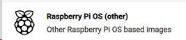
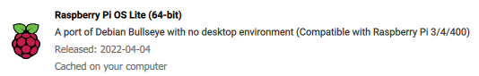
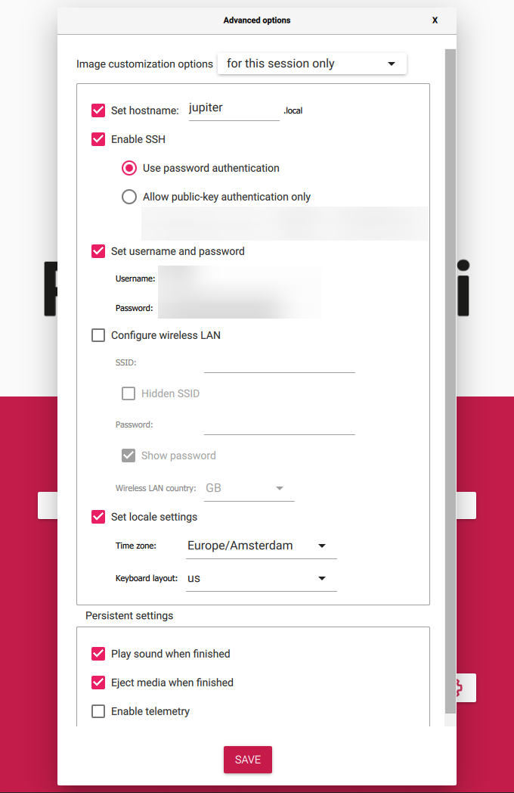

<h1 align="center">
  ⚡ Flashing the OS
</h1>

<b>Table of Contents</b>

- [Overview](#overview)
- [1. Selecting the OS](#1-selecting-the-os)
- [2. Changing settings](#2-changing-settings)
- [3. Flash the image](#3-flash-the-image)

## Overview

The OS[^1] I am using for my server is "Raspberry Pi OS Lite (64-Bit)"[^2].

To flash the image I use [Raspberry Pi Imager](https://www.raspberrypi.com/software/).

## 1. Selecting the OS
1. Raspberry Pi OS (Other)  
2. Raspberry Pi OS Lite (64-bit)  

## 2. Changing settings
1. Click the settings cog (bottom right)  
2. Change the settings to the following  

## 3. Flash the image
1. Click write!

[^1]: https://en.wikipedia.org/wiki/Operating_system
[^2]: https://downloads.raspberrypi.org/raspios_lite_arm64/images/
